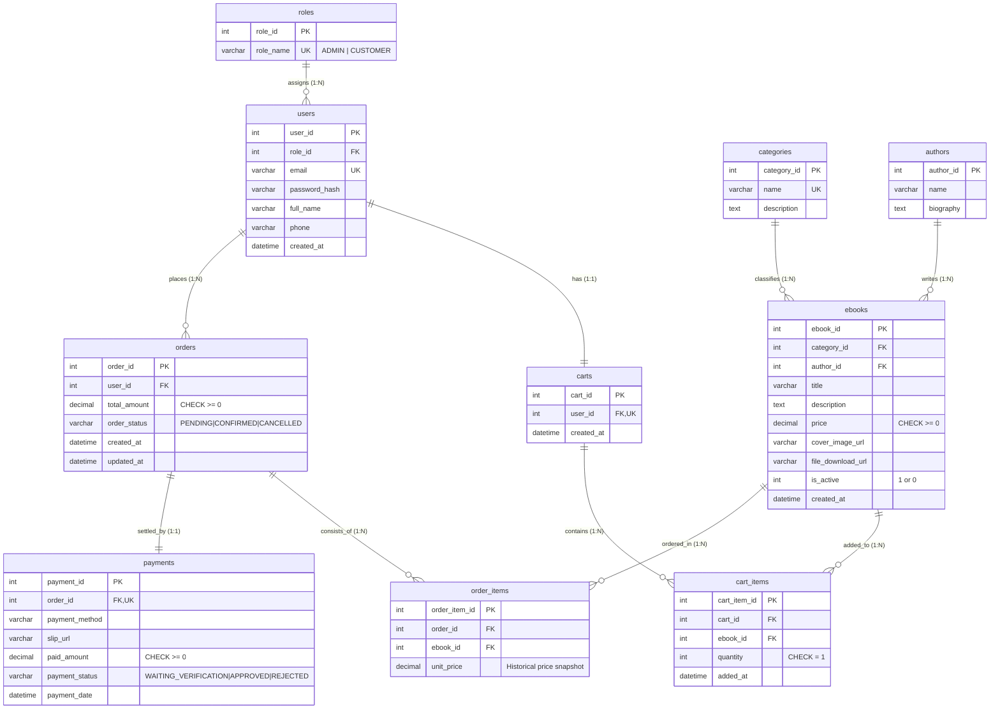

# 📘 รายงานสรุปโครงงานและเอกสารส่งงาน (Mini Project Database Submission Report)
## โครงงานพัฒนาระบบร้านค้าและบริหารจัดการฐานข้อมูล E-Book จำลอง (2026)
### รายวิชา Database Mini Project (วิชาการออกแบบและพัฒนาฐานข้อมูล)

---

## 1. ข้อมูลทั่วไปของโครงงานและข้อมูลกลุ่ม (Group Information)

| รายการ | รายละเอียด |
| :--- | :--- |
| **รายวิชาและตอนเรียน** | รายวิชา Database Mini Project |
| **ชื่อโครงงาน** | ระบบร้านค้าและบริหารจัดการฐานข้อมูล E-Book (E-Book Store Database Management Platform) |
| **สมาชิกคนที่ 1** | นายชนวีร์ ยะลินทร์ (รหัสนักศึกษา: ................................................) |
| **สมาชิกคนที่ 2** | ................................................................... (รหัสนักศึกษา: ................................................) |
| **เครื่องมือที่ใช้พัฒนา** | **ภาษา:** Python 3.11 / 3.14, HTML5, CSS3, JavaScript (Vanilla ES6)<br>**เว็บเฟรมเวิร์ก:** Flask, Jinja2 Template Engine, Gunicorn<br>**DBMS:** PostgreSQL (Supabase Cloud) เป็นระบบหลัก, SQLite (Local Development), รองรับ MySQL (Railway)<br>**บริการ Cloud & เครื่องมือเสริม:** Render.com (Web Hosting Platform), Supabase (Cloud Database Pooler), DBeaver / TablePlus (Database Management GUI), Git / GitHub (Version Control) |

### การแบ่งหน้าที่และความรับผิดชอบของสมาชิกในกลุ่ม (Team Work Allocation)

| สมาชิก | หน้าที่หลัก (Responsibility) | ส่วนที่ต้องอธิบายในการนำเสนอ (Defense Topics) |
| :--- | :--- | :--- |
| **สมาชิกคนที่ 1** | • ออกแบบโครงสร้างฐานข้อมูลเชิงสัมพันธ์ 3NF (ER Diagram & Data Dictionary)<br>• พัฒนา Backend ระบบยืนยันตัวตน, ระบบสิทธิ์ (RBAC), และระบบตะกร้าสินค้า<br>• เขียนคำสั่ง SQL Analytical Reports (รายงานที่ 1 และ 2) และสร้างชุดข้อมูลจำลอง (Seed Data) | 1. โครงสร้าง ERD และความสัมพันธ์ระหว่างตาราง `users`, `roles`, `categories`, `ebooks`, `authors`<br>2. การทำงานของคำสั่ง SQL รายงานที่ 1 (ยอดขายรายเดือน) และ รายงานที่ 2 (หนังสือขายดี Top 5)<br>3. เส้นทางการทำงาน (User Journey) ของสมาชิกลูกค้า (การค้นหา, สั่งซื้อ, ดาวน์โหลด) |
| **สมาชิกคนที่ 2** | • พัฒนา Backend ระบบ Checkout Transaction และความปลอดภัยในการดาวน์โหลด (Download Guardrail)<br>• พัฒนาระบบหลังบ้านสำหรับผู้ดูแล (Admin Panel: จัดการคำสั่งซื้อ, สลิป, หนังสือ, หมวดหมู่, สิทธิ์)<br>• เขียนคำสั่ง SQL Analytical Reports (รายงานที่ 3 และ 4) และจัดทำชุดทดสอบอัตโนมัติ (Automated Unit Tests) | 1. ความสัมพันธ์ตาราง `orders`, `order_items`, `payments`, `carts`, `cart_items`<br>2. การทำงานของคำสั่ง SQL รายงานที่ 3 (ยอดขายตามหมวดหมู่) และ รายงานที่ 4 (CLV & สถานะคำสั่งซื้อด้วย `HAVING`)<br>3. ระบบตรวจสอบสลิป, การทำงานของ Database Transaction, และระบบ Download Security Guardrail |

---

## 2. ลิงก์ระบบออนไลน์ แหล่งโค้ด และบัญชีทดสอบ (Deployment & Test Accounts)

* 🌐 **ลิงก์เข้าใช้งานระบบออนไลน์ (Live Website):**  
  [https://book-store-mini-project-database.onrender.com](https://book-store-mini-project-database.onrender.com)
* 🗄️ **ฐานข้อมูลระบบจริงบน Cloud (Production DBMS):**  
  PostgreSQL บน Supabase Cloud (AWS Singapore Region - High Availability Pooler)
* 💻 **คลังเก็บโค้ดสาธารณะ (GitHub Repository):**  
  [https://github.com/chonnawee-ya/book-store-mini-project-database](https://github.com/chonnawee-ya/book-store-mini-project-database)

### บัญชีผู้ใช้งานสำหรับผู้สอนและกรรมการตรวจประเมิน (Test Credentials)

| บทบาท (Role) | อีเมล (Email) | รหัสผ่าน (Password) | สิทธิ์และการทดสอบ |
| :--- | :--- | :--- | :--- |
| **ผู้ดูแลระบบ (Admin)** | `admin@ebookstore.com` | `admin123` | เข้าถึงเมนู `/admin`, อนุมัติสลิปคำสั่งซื้อ, เพิ่ม/แก้ไข/เปิด-ปิดขาย E-Book, ปรับเปลี่ยนสิทธิ์ผู้ใช้ |
| **ลูกค้าทดสอบ 1 (Customer)** | `customer@ebookstore.com` | `customer123` | ค้นหาหนังสือ, เพิ่มลงตะกร้า, สั่งซื้อ Checkout, แนบสลิป, ตรวจสอบสิทธิ์ดาวน์โหลด |
| **ลูกค้าทดสอบ 2 (Customer)** | `jane@example.com` | `password123` | ลูกค้าที่มีประวัติคำสั่งซื้อหลายสถานะ (CONFIRMED, PENDING, CANCELLED) เพื่อทดสอบดาวน์โหลด |

> 💡 **ฟีเจอร์ Demo Switcher:** ที่แถบด้านบนสุดของหน้าเว็บ มีปุ่มสำหรับคลิกสลับผู้ใช้งานจำลอง (Demo Switcher) ได้ทันที 1-Click โดยไม่ต้องเสียเวลากรอกรหัสผ่านซ้ำ สะดวกต่อการสาธิตหน้าชั้นเรียน

---

## 3. การออกแบบฐานข้อมูลเชิงสัมพันธ์ (Database Schema & Normalization)

ระบบได้รับการออกแบบโครงสร้างตามหลักการ **Third Normal Form (3NF)** อย่างสมบูรณ์ เพื่อลดความซ้ำซ้อนของข้อมูล (Data Redundancy) ป้องกันความผิดปกติในการจัดการข้อมูล (Insertion, Update, Deletion Anomalies) และมี Referential Integrity ด้วย Foreign Key Constraints

### 3.1 แผนภาพความสัมพันธ์ฐานข้อมูล (Entity Relationship Diagram - ERD)



---

### 3.2 พจนานุกรมข้อมูล (Data Dictionary ครบ 10 ตาราง)

#### ตารางที่ 1: `roles` (ตารางบทบาทผู้ใช้งาน)
| ชื่อฟิลด์ (Column) | ชนิดข้อมูล (Data Type) | คีย์ (Key) | Nullable | ค่าเริ่มต้น (Default) | ข้อจำกัด (Constraint) | คำอธิบาย (Description) |
| :--- | :--- | :---: | :---: | :---: | :--- | :--- |
| `role_id` | INT / SERIAL | **PK** | NO | Auto Increment | PRIMARY KEY | รหัสบทบาทผู้ใช้ |
| `role_name` | VARCHAR(50) | - | NO | - | UNIQUE, NOT NULL | ชื่อสิทธิ์ เช่น 'ADMIN', 'CUSTOMER' |

#### ตารางที่ 2: `users` (ตารางข้อมูลสมาชิก)
| ชื่อฟิลด์ | ชนิดข้อมูล | คีย์ | Nullable | ค่าเริ่มต้น | ข้อจำกัด | คำอธิบาย |
| :--- | :--- | :---: | :---: | :---: | :--- | :--- |
| `user_id` | INT / SERIAL | **PK** | NO | Auto Increment | PRIMARY KEY | รหัสผู้ใช้งาน |
| `role_id` | INT | **FK** | NO | 2 (CUSTOMER) | REFERENCES `roles(role_id)` | รหัสบทบาทหน้าที่ |
| `email` | VARCHAR(100) | - | NO | - | UNIQUE, NOT NULL | อีเมลล็อกอิน (ห้ามซ้ำ) |
| `password_hash` | VARCHAR(255) | - | NO | - | NOT NULL | แฮชรหัสผ่านความปลอดภัยสูง |
| `full_name` | VARCHAR(100) | - | NO | - | NOT NULL | ชื่อ-นามสกุลจริง |
| `phone` | VARCHAR(20) | - | YES | NULL | - | เบอร์โทรศัพท์ติดต่อ |
| `created_at` | DATETIME | - | NO | CURRENT_TIMESTAMP | NOT NULL | วันที่และเวลาลงทะเบียน |

#### ตารางที่ 3: `categories` (ตารางหมวดหมู่หนังสือ)
| ชื่อฟิลด์ | ชนิดข้อมูล | คีย์ | Nullable | ค่าเริ่มต้น | ข้อจำกัด | คำอธิบาย |
| :--- | :--- | :---: | :---: | :---: | :--- | :--- |
| `category_id` | INT / SERIAL | **PK** | NO | Auto Increment | PRIMARY KEY | รหัสหมวดหมู่ |
| `name` | VARCHAR(100) | - | NO | - | UNIQUE, NOT NULL | ชื่อหมวดหมู่หนังสือ |
| `description` | TEXT | - | YES | NULL | - | คำอธิบายหมวดหมู่ |

#### ตารางที่ 4: `authors` (ตารางข้อมูลนักเขียน/ผู้แต่ง)
| ชื่อฟิลด์ | ชนิดข้อมูล | คีย์ | Nullable | ค่าเริ่มต้น | ข้อจำกัด | คำอธิบาย |
| :--- | :--- | :---: | :---: | :---: | :--- | :--- |
| `author_id` | INT / SERIAL | **PK** | NO | Auto Increment | PRIMARY KEY | รหัสผู้แต่ง |
| `name` | VARCHAR(100) | - | NO | - | NOT NULL | ชื่อ-นามสกุลผู้แต่ง |
| `biography` | TEXT | - | YES | NULL | - | ประวัติและผลงานย่อ |

#### ตารางที่ 5: `ebooks` (ตารางหนังสือดิจิทัล)
| ชื่อฟิลด์ | ชนิดข้อมูล | คีย์ | Nullable | ค่าเริ่มต้น | ข้อจำกัด | คำอธิบาย |
| :--- | :--- | :---: | :---: | :---: | :--- | :--- |
| `ebook_id` | INT / SERIAL | **PK** | NO | Auto Increment | PRIMARY KEY | รหัสหนังสือ E-Book |
| `category_id` | INT | **FK** | NO | - | REFERENCES `categories(category_id)` | รหัสหมวดหมู่ |
| `author_id` | INT | **FK** | NO | - | REFERENCES `authors(author_id)` | รหัสผู้แต่ง |
| `title` | VARCHAR(200) | - | NO | - | NOT NULL | ชื่อเรื่องหนังสือ |
| `description` | TEXT | - | YES | NULL | - | รายละเอียดเนื้อหา |
| `price` | DECIMAL(10,2) | - | NO | 0.00 | CHECK (price >= 0.00) | ราคาขาย (ห้ามติดลบ) |
| `cover_image_url` | VARCHAR(500) | - | YES | NULL | - | URL ลิงก์ภาพหน้าปก |
| `file_download_url`| VARCHAR(500) | - | NO | - | NOT NULL | URL ดาวน์โหลดไฟล์หนังสือ |
| `is_active` | INT | - | NO | 1 | CHECK (is_active IN (0,1)) | สถานะเปิดขาย (1=เปิด, 0=ปิด) |
| `created_at` | DATETIME | - | NO | CURRENT_TIMESTAMP | NOT NULL | วันที่ลงรายการหนังสือ |

#### ตารางที่ 6: `carts` (ตารางตะกร้าสินค้าของผู้ใช้)
| ชื่อฟิลด์ | ชนิดข้อมูล | คีย์ | Nullable | ค่าเริ่มต้น | ข้อจำกัด | คำอธิบาย |
| :--- | :--- | :---: | :---: | :---: | :--- | :--- |
| `cart_id` | INT / SERIAL | **PK** | NO | Auto Increment | PRIMARY KEY | รหัสตะกร้า |
| `user_id` | INT | **FK** | NO | - | UNIQUE, REFERENCES `users(user_id)` ON DELETE CASCADE | รหัสผู้ใช้เจ้าของตะกร้า (1:1) |
| `created_at` | DATETIME | - | NO | CURRENT_TIMESTAMP | NOT NULL | วันที่สร้างตะกร้า |

#### ตารางที่ 7: `cart_items` (ตารางรายการสินค้าในตะกร้า)
| ชื่อฟิลด์ | ชนิดข้อมูล | คีย์ | Nullable | ค่าเริ่มต้น | ข้อจำกัด | คำอธิบาย |
| :--- | :--- | :---: | :---: | :---: | :--- | :--- |
| `cart_item_id` | INT / SERIAL | **PK** | NO | Auto Increment | PRIMARY KEY | รหัสรายการในตะกร้า |
| `cart_id` | INT | **FK** | NO | - | REFERENCES `carts(cart_id)` ON DELETE CASCADE | รหัสตะกร้า |
| `ebook_id` | INT | **FK** | NO | - | REFERENCES `ebooks(ebook_id)` | รหัสหนังสือที่เลือก |
| `quantity` | INT | - | NO | 1 | CHECK (quantity = 1) | บังคับ 1 เล่มต่อ 1 สิทธิ์ดิจิทัล |
| `added_at` | DATETIME | - | NO | CURRENT_TIMESTAMP | NOT NULL | วันเวลาที่เพิ่มลงตะกร้า |

#### ตารางที่ 8: `orders` (ตารางคำสั่งซื้อ)
| ชื่อฟิลด์ | ชนิดข้อมูล | คีย์ | Nullable | ค่าเริ่มต้น | ข้อจำกัด | คำอธิบาย |
| :--- | :--- | :---: | :---: | :---: | :--- | :--- |
| `order_id` | INT / SERIAL | **PK** | NO | Auto Increment | PRIMARY KEY | รหัสคำสั่งซื้อ |
| `user_id` | INT | **FK** | NO | - | REFERENCES `users(user_id)` | รหัสผู้สั่งซื้อ |
| `total_amount` | DECIMAL(10,2) | - | NO | 0.00 | CHECK (total_amount >= 0.00) | ยอดรวมเงินคำสั่งซื้อ |
| `order_status` | VARCHAR(20) | - | NO | 'PENDING' | CHECK (order_status IN ('PENDING', 'CONFIRMED', 'CANCELLED')) | สถานะของคำสั่งซื้อ |
| `created_at` | DATETIME | - | NO | CURRENT_TIMESTAMP | NOT NULL | วันเวลาที่ทำการสั่งซื้อ |
| `updated_at` | DATETIME | - | NO | CURRENT_TIMESTAMP | NOT NULL | วันเวลาที่อัปเดตสถานะล่าสุด |

#### ตารางที่ 9: `order_items` (ตารางรายการหนังสือในคำสั่งซื้อ)
| ชื่อฟิลด์ | ชนิดข้อมูล | คีย์ | Nullable | ค่าเริ่มต้น | ข้อจำกัด | คำอธิบาย |
| :--- | :--- | :---: | :---: | :---: | :--- | :--- |
| `order_item_id` | INT / SERIAL | **PK** | NO | Auto Increment | PRIMARY KEY | รหัสรายการสั่งซื้อ |
| `order_id` | INT | **FK** | NO | - | REFERENCES `orders(order_id)` ON DELETE CASCADE | รหัสคำสั่งซื้อหลัก |
| `ebook_id` | INT | **FK** | NO | - | REFERENCES `ebooks(ebook_id)` | รหัสหนังสือที่ซื้อ |
| `unit_price` | DECIMAL(10,2) | - | NO | - | CHECK (unit_price >= 0.00) | ราคาประวัติ ณ ขณะกดสั่งซื้อ |

#### ตารางที่ 10: `payments` (ตารางบันทึกการชำระเงินจำลอง)
| ชื่อฟิลด์ | ชนิดข้อมูล | คีย์ | Nullable | ค่าเริ่มต้น | ข้อจำกัด | คำอธิบาย |
| :--- | :--- | :---: | :---: | :---: | :--- | :--- |
| `payment_id` | INT / SERIAL | **PK** | NO | Auto Increment | PRIMARY KEY | รหัสการชำระเงิน |
| `order_id` | INT | **FK** | NO | - | UNIQUE, REFERENCES `orders(order_id)` ON DELETE CASCADE | รหัสคำสั่งซื้อ (1:1) |
| `payment_method`| VARCHAR(50) | - | NO | 'SIMULATED_TRANSFER' | NOT NULL | วิธีชำระเงินจำลอง |
| `slip_url` | VARCHAR(500) | - | YES | NULL | - | ลิงก์รูปสลิปหลักฐานจำลอง |
| `paid_amount` | DECIMAL(10,2) | - | NO | 0.00 | CHECK (paid_amount >= 0.00) | ยอดเงินที่แจ้งชำระ |
| `payment_status`| VARCHAR(20) | - | NO | 'WAITING_VERIFICATION' | CHECK (payment_status IN ('WAITING_VERIFICATION', 'APPROVED', 'REJECTED')) | สถานะการตรวจสอบสลิป |
| `payment_date` | DATETIME | - | NO | CURRENT_TIMESTAMP | NOT NULL | วันเวลาที่แจ้งชำระเงิน |

---

### 3.3 คำอธิบายการปรับแบบข้อมูลสู่ Third Normal Form (3NF Normalization)

ระบบนี้ผ่านการวิเคราะห์ Normalization ตามขั้นตอนดังนี้:

1. **First Normal Form (1NF):**
   - ทุกคอลัมน์เก็บค่าที่เป็นอะตอม (Atomic Values) ไม่มีฟิลด์ที่เก็บข้อมูลแบบลิสต์หรือคั่นด้วยจุลภาค
   - ทุกแถวสามารถระบุเอกลักษณ์ได้ด้วย Primary Key (เช่น `ebook_id`, `order_id`)
   - มีการแยกตาราง `order_items` และ `cart_items` ออกมา เพื่อไม่ให้เกิด Repeating Groups ในตาราง `orders` และ `carts`

2. **Second Normal Form (2NF):**
   - ข้อมูลอยู่ใน 1NF ครบถ้วน
   - ทุกคอลัมน์ที่ไม่ใช่คีย์หลักขึ้นตรงต่อ Primary Key ทั้งหมดอย่างสมบูรณ์ (No Partial Dependency) โดยเฉพาะในตารางที่มีลักษณะความสัมพันธ์แบบหลายต่อหลาย (M:N) ได้ถูกแตกออกเป็นตาราง Associative Entity พร้อม Primary Key เดี่ยวของตัวเอง (`order_item_id`, `cart_item_id`)

3. **Third Normal Form (3NF):**
   - ข้อมูลอยู่ใน 2NF ครบถ้วน
   - ขจัดความขึ้นต่อกันระหว่างฟิลด์ที่ไม่ใช่คีย์หลัก (No Transitive Dependency):
     - แยกข้อมูล `categories` (ชื่อหมวด, คำอธิบาย) และ `authors` (ชื่อผู้แต่ง, ประวัติ) ออกจากตาราง `ebooks` เพื่อป้องกันไม่ให้ข้อมูลหมวดหมู่และนักเขียนซ้ำซ้อนเมื่อมีหนังสือหลายเล่ม
     - แยกข้อมูล `roles` ออกจาก `users` เพื่อให้สามารถจัดการสิทธิ์แบบมาตรฐาน
     - **ข้อยกเว้นที่มีเหตุผลเชิงธุรกิจ (Intentional Design Choice):** ตาราง `order_items` มีการจัดเก็บฟิลด์ `unit_price` ซ้ำกับ `ebooks.price` เพื่อทำหน้าที่เป็น **Price Snapshot** บันทึกราคา ณ ขณะที่ลูกค้าทำการสั่งซื้อจริง หากในอนาคตแอดมินมีการแก้ไขปรับราคาหนังสือในตาราง `ebooks` ยอดเงินในประวัติคำสั่งซื้อเดิมจะไม่ผิดเพี้ยน

---

## 4. คู่มือการสาธิตระบบ (System Demonstration Walkthrough)

### 4.1 เส้นทางการใช้งานของลูกค้า (Customer User Journey)

```
[1. ค้นหาหนังสือ] ➔ [2. ดูรายละเอียด] ➔ [3. หยิบใส่ตะกร้า] ➔ [4. Checkout คำสั่งซื้อ] ➔ [5. แจ้งชำระเงินจำลอง] ➔ [6. รออนุมัติ / ดาวน์โหลด]
```

1. **การค้นหาและคัดกรองหนังสือ (Search & Filter):**
   - เปิดหน้าแรก (`/`) สมาชิกสามารถพิมพ์คำค้นหาชื่อหนังสือในช่องค้นหา หรือคลิกเลือกหมวดหมู่ที่ต้องการ (เช่น วิทยาการคอมพิวเตอร์, การเงินการลงทุน) ระบบจะกรองเฉพาะหนังสือที่เปิดขาย (`is_active = 1`) มาแสดงผล
2. **การใส่ตะกร้าสินค้า (Cart Management):**
   - คลิกปุ่ม "เพิ่มลงตะกร้า" ที่การ์ดหนังสือ ระบบจะตรวจสอบว่ามีหนังสือนั้นในตะกร้าแล้วหรือไม่ หากมีแล้วจะแจ้งเตือนว่ามีสินค้าอยู่แล้ว (เนื่องจากเป็น E-Book ซื้อได้ 1 เล่มต่อ 1 บัญชี)
3. **การสั่งซื้อผ่าน Database Transaction (Checkout Process):**
   - ไปที่หน้าตะกร้า (`/cart`) ตรวจสอบยอดรวม แล้วกดปุ่ม "ดำเนินการสั่งซื้อ (Checkout)"
   - ระบบจะเข้าสู่ขั้นตอน Database Transaction:
     - ตรวจสอบความถูกต้องของสินค้า
     - สร้างเรคอร์ดในตาราง `orders` (สถานะ `PENDING`)
     - คัดลอกรายการจาก `cart_items` ไปบันทึกลง `order_items` พร้อมบันทึก `unit_price` ณ ขณะนั้น
     - สร้างเรคอร์ดการชำระเงินเริ่มต้นใน `payments`
     - เคลียร์สินค้าออกจากตะกร้า (`cart_items`)
     - สั่ง `COMMIT` หากไม่มีข้อผิดพลาด หรือ `ROLLBACK` หากเกิดปัญหา
4. **การชำระเงินจำลอง (Simulated Payment & Mock Slip):**
   - ลูกค้าสามารถกดดู QR Code จำลอง และสามารถเลือกใส่ URL ภาพสลิปจำลอง หรือกดปุ่ม "ใช้สลิปตัวอย่างของระบบ" แล้วกดยืนยันแจ้งชำระเงิน
5. **การทดสอบความปลอดภัยในการดาวน์โหลด (Download Security Guardrail Test):**
   - ไปที่หน้าประวัติคำสั่งซื้อ (`/orders`)
   - **กรณีที่คำสั่งซื้อยังเป็น `PENDING`:** ปุ่มดาวน์โหลดจะถูกปิดล็อก พร้อมแสดงป้าย "รอการอนุมัติคำสั่งซื้อ" หากผู้ใช้พยายามพิมพ์ URL ตรงเพื่อดาวน์โหลด (`/download/order/<id>/ebook/<id>`) ระบบจะทำการบล็อกทันที (HTTP 403 / Flash Warning)
   - **กรณีที่คำสั่งซื้อเปลี่ยนเป็น `CONFIRMED` แล้ว:** ปุ่ม "ดาวน์โหลด E-Book" จะปลดล็อกเป็นสีเขียว ลูกค้าสามารถกดดาวน์โหลดไฟล์หนังสือจริง/ใบยืนยันสิทธิ์ที่มีชื่อผู้สั่งซื้อระบุอย่างถูกต้องได้ทันที

---

### 4.2 เส้นทางการใช้งานของผู้ดูแลระบบ (Admin User Journey)

1. **การเข้าสู่แผงควบคุมหลังบ้าน (Admin Panel):**
   - สลับบทบาทเป็น Admin ด้วยปุ่ม Demo Switcher หรือล็อกอินด้วย `admin@ebookstore.com`
   - คลิกเมนู **"ระบบจัดการ (Admin)"** (`/admin`) ซึ่งได้รับการป้องกันด้วย `@login_required(role="ADMIN")`
2. **การตรวจสอบและอนุมัติคำสั่งซื้อ (US-08):**
   - ที่แท็บ **"📦 จัดการคำสั่งซื้อ"** จะแสดงรายการออเดอร์ทั้งหมด
   - สามารถคลิกปุ่ม **"🔍 ดูรูปสลิป"** เพื่อเปิดหน้าต่าง Modal ตรวจสอบหลักฐานการโอนเงินจำลอง
   - คลิกปุ่ม **"✓ อนุมัติ"** เพื่อเปลี่ยนสถานะเป็น `CONFIRMED` (ซึ่งจะไปปรับ `payment_status` เป็น `APPROVED` พร้อมกันโดยอัตโนมัติ และปลดล็อกสิทธิ์ดาวน์โหลดให้ลูกค้าทันที) หรือคลิก **"✕ ปฏิเสธ"** เพื่อยกเลิก
3. **การเพิ่มและแก้ไขข้อมูล E-Book (US-06):**
   - **การเพิ่มหนังสือใหม่:** กรอกแบบฟอร์มด้านซ้ายมือ (ชื่อเรื่อง, หมวดหมู่, ผู้แต่ง, ราคา, คำอธิบาย, ลิงก์รูปปก, ไฟล์ดาวน์โหลด) แล้วกดบันทึก
   - **การแก้ไขข้อมูลหนังสือ:** ที่ตารางด้านขวา กดปุ่ม **"✏️ แก้ไข"** ระบบจะเปิดหน้าต่าง Modal ดึงข้อมูลเดิมของเล่มนั้นมาให้แก้ไขได้ทุกฟิลด์ แล้วกด "💾 บันทึกการแก้ไข" ข้อมูลจะถูกอัปเดตลงฐานข้อมูลทันที
   - **การเปิด/ปิดการขาย:** กดปุ่ม "ปิดขาย" หรือ "เปิดขาย" เพื่อสลับค่า `is_active` ทันที
4. **การจัดการหมวดหมู่สินค้า (US-07):**
   - เพิ่มหมวดหมู่ใหม่ โดยมีระบบตรวจเช็กชื่อหมวดหมู่ซ้ำ (UNIQUE constraint)
5. **การจัดการบทบาทผู้ใช้งาน (US-09):**
   - แอดมินสามารถปรับเปลี่ยนสิทธิ์ผู้ใช้ระหว่าง `CUSTOMER` และ `ADMIN` ได้
   - **ระบบความปลอดภัยป้องกันตนเอง (Self-Demotion Guard):** ระบบจะไม่อนุญาตให้แอดมินปลดสิทธิ์บัญชีของตนเอง เพื่อป้องกันปัญหาบัญชีหลุดจากระบบบริหารจัดการ
6. **การวิเคราะห์ข้อมูลและทดสอบ SQL สด (Analytics & Explorer):**
   - เข้าเมนู **"รายงานวิเคราะห์"** (`/analytics`) เพื่อดู 4 รายงานเชิงลึก
   - เข้าเมนู **"สำรวจฐานข้อมูล"** (`/database-explorer`) เพื่อดู Data Dictionary และพิมพ์คำสั่ง SQL ผ่าน Interactive SQL Runner โดยมี Read-Only Guard ป้องกันคำสั่งทำลายข้อมูล

---

## 5. รายงานเชิงวิเคราะห์ 4 ด้านจากข้อมูลในระบบจริง (Analytical SQL Reports)

รายงานทั้ง 4 ด้านประมวลผลผ่านคำสั่ง SQL ชั้นสูงที่ใช้ Aggregation (`SUM`, `AVG`, `COUNT`), `JOIN`, `GROUP BY`, และ `HAVING` โดยตรงจากฐานข้อมูลที่มีข้อมูลตัวอย่างมากกว่า 30 คำสั่งซื้อ (ระบบมี Seed Data 33 คำสั่งซื้อจริง):

### รายงานที่ 1: ยอดขายตามช่วงเวลารายเดือน (Monthly Sales Trend & Average Order Value)
* **คำถามที่ต้องตอบ:** ยอดขายรวม จำนวนคำสั่งซื้อ และยอดเฉลี่ยต่อคำสั่งซื้อ (AOV) มีแนวโน้มเปลี่ยนแปลงอย่างไรในแต่ละเดือน?
* **คำสั่ง SQL (รองรับ PostgreSQL, SQLite และ MySQL):**
```sql
SELECT 
    CASE 
        WHEN strftime('%Y-%m', o.created_at) IS NOT NULL THEN strftime('%Y-%m', o.created_at)
        ELSE TO_CHAR(o.created_at, 'YYYY-MM')
    END AS sales_month,
    COUNT(o.order_id) AS total_orders,
    SUM(o.total_amount) AS total_revenue,
    ROUND(AVG(o.total_amount), 2) AS average_order_value
FROM orders o
WHERE o.order_status = 'CONFIRMED'
GROUP BY 1
ORDER BY sales_month ASC;
```
* **คำอธิบายทางเทคนิค:** กรองเฉพาะคำสั่งซื้อที่ชำระเงินสำเร็จ (`order_status = 'CONFIRMED'`), จัดกลุ่มตามเดือนด้วย `GROUP BY`, คำนวณยอดขายรวมด้วย `SUM()`, จำนวนออเดอร์ด้วย `COUNT()`, และค่าเฉลี่ยต่อตะกร้าด้วย `AVG()`

---

### รายงานที่ 2: 5 อันดับหนังสือขายดี (Top 5 Best-Selling E-Books)
* **คำถามที่ต้องตอบ:** หนังสือเล่มใดขายดีที่สุดทั้งในแง่จำนวนเล่มที่จำหน่ายได้และมูลค่ายอดขายรวม?
* **คำสั่ง SQL:**
```sql
SELECT 
    b.ebook_id,
    b.title,
    a.name AS author_name,
    COUNT(oi.order_item_id) AS units_sold,
    SUM(oi.unit_price) AS total_sales_amount
FROM order_items oi
JOIN orders o ON oi.order_id = o.order_id
JOIN ebooks b ON oi.ebook_id = b.ebook_id
JOIN authors a ON b.author_id = a.author_id
WHERE o.order_status = 'CONFIRMED'
GROUP BY b.ebook_id, b.title, a.name
ORDER BY units_sold DESC, total_sales_amount DESC
LIMIT 5;
```
* **คำอธิบายทางเทคนิค:** เชื่อมโยง 4 ตาราง (`order_items`, `orders`, `ebooks`, `authors`), คัดกรองเฉพาะคำสั่งซื้อที่ยืนยันแล้ว, จัดกลุ่มตามหนังสือเพื่อหาผลรวมจำนวนเล่มและยอดเงิน แล้วเรียงลำดับจากมากไปน้อย จำกัดผลลัพธ์ 5 อันดับด้วย `LIMIT 5`

---

### รายงานที่ 3: สรุปยอดขายแยกตามหมวดหมู่ (Sales & Volume by Category)
* **คำถามที่ต้องตอบ:** หมวดหมู่หนังสือใดสร้างรายได้สูงสุด และหมวดหมู่ใดมียอดสั่งซื้อมากที่สุด?
* **คำสั่ง SQL:**
```sql
SELECT 
    c.category_id,
    c.name AS category_name,
    COUNT(DISTINCT o.order_id) AS order_count,
    COUNT(oi.order_item_id) AS total_books_sold,
    COALESCE(ROUND(SUM(oi.unit_price), 2), 0.00) AS total_revenue
FROM categories c
LEFT JOIN ebooks b ON c.category_id = b.category_id
LEFT JOIN order_items oi ON b.ebook_id = oi.ebook_id
LEFT JOIN orders o ON oi.order_id = o.order_id AND o.order_status = 'CONFIRMED'
GROUP BY c.category_id, c.name
ORDER BY total_revenue DESC;
```
* **คำอธิบายทางเทคนิค:** ใช้เทคนิค `LEFT JOIN` หลายตาราง เพื่อให้หมวดหมู่ที่ยังไม่มียอดขายแสดงผลด้วยตัวเลข 0 (ไม่หลุดหายไปจากรายงาน) พร้อมใช้ `COUNT(DISTINCT o.order_id)` นับคำสั่งซื้อที่ไม่ซ้ำ และ `COALESCE` ดักค่า NULL ให้เป็น 0.00 อย่างสวยงาม

---

### รายงานที่ 4: พฤติกรรมลูกค้าและสถานะคำสั่งซื้อ (Customer Lifetime Value - CLV)
* **คำถามที่ต้องตอบ:** ลูกค้ารายใดมียอดใช้จ่ายสะสมสูงสุด และในแต่ละคนมีสัดส่วนออเดอร์ที่สำเร็จ รอดำเนินการ หรือถูกยกเลิกเป็นจำนวนเท่าใด?
* **คำสั่ง SQL (PostgreSQL & ANSI SQL 100% Compatible):**
```sql
SELECT 
    u.user_id,
    u.full_name,
    u.email,
    COUNT(o.order_id) AS total_orders_placed,
    SUM(CASE WHEN o.order_status = 'CONFIRMED' THEN 1 ELSE 0 END) AS confirmed_orders,
    SUM(CASE WHEN o.order_status = 'PENDING' THEN 1 ELSE 0 END) AS pending_orders,
    SUM(CASE WHEN o.order_status = 'CANCELLED' THEN 1 ELSE 0 END) AS cancelled_orders,
    COALESCE(ROUND(SUM(CASE WHEN o.order_status = 'CONFIRMED' THEN o.total_amount ELSE 0 END), 2), 0.00) AS total_spent
FROM users u
JOIN orders o ON u.user_id = o.user_id
GROUP BY u.user_id, u.full_name, u.email
HAVING COUNT(o.order_id) >= 1
ORDER BY total_spent DESC;
```
* **คำอธิบายทางเทคนิค:** ใช้เทคนิค **Conditional Aggregation** (`SUM(CASE WHEN...)`) ในการ Pivot ข้อมูลสถานะคำสั่งซื้อออกเป็นคอลัมน์แยกในคำสั่ง SQL เดียว พร้อมใช้ `HAVING COUNT(o.order_id) >= 1` เพื่อกรองเฉพาะสมาชิกที่มีประวัติการสั่งซื้ออย่างน้อย 1 ครั้ง โดยไม่ใช้นามแฝง เพื่อความเข้ากันได้กับฐานข้อมูล PostgreSQL บน Cloud

---

## 6. ผลการทดสอบระบบและคุณภาพข้อมูล (Automated Test Cases 8 กรณี)

ระบบมีชุดทดสอบอัตโนมัติ (Automated Unit Tests) ในไฟล์ `tests/test_database_and_rules.py` รันผ่านคำสั่ง `python -m unittest discover tests` ครอบคลุมทั้ง 8 กรณีทดสอบหลัก:

| รหัสทดสอบ (TC ID) | วัตถุประสงค์การทดสอบ | ข้อมูลนำเข้า (Input Data) | ผลลัพธ์ที่คาดหวัง (Expected Result) | ผลลัพธ์ที่เกิดขึ้นจริง (Actual Result) | สถานะ | วิธีแก้ไขหากพบปัญหา (Resolution) |
| :---: | :--- | :--- | :--- | :--- | :---: | :--- |
| **TC-01** | สมัครสมาชิกสำเร็จด้วยอีเมลใหม่ | อีเมลใหม่: `newuser@test.com`, รหัสผ่าน, ชื่อ | บันทึกสมาชิกลงตาราง `users` สำเร็จ แฮชรหัสผ่านถูกต้อง และสร้างตาราง `carts` ประจำตัวให้อัตโนมัติ | ผู้ใช้ถูกสร้างในระบบ, รหัสผ่านถูกแฮชด้วย pbkdf2, มี cart_id ผูกทันที | **PASS** | ตรวจสอบ Foreign Key `role_id=2` และการ Commit Transaction |
| **TC-02**<br>*(Negative)* | สมัครสมาชิกด้วยอีเมลซ้ำในระบบ | อีเมลเดิมที่มีอยู่แล้ว: `admin@ebookstore.com` | ระบบต้องปฏิเสธการบันทึกตามเงื่อนไข `UNIQUE constraint failed: users.email` | ระบบแจ้งเตือนข้อผิดพลาด อีเมลนี้ถูกใช้งานแล้ว และปฏิเสธการ Insert | **PASS** | ดักจับ Unique Violation Exception และแจ้งเตือนผ่าน Flash Message |
| **TC-03**<br>*(Negative)* | แอดมินเพิ่ม E-Book ที่มีราคาติดลบ | ข้อมูลหนังสือ, ราคา = `-150.00` | ระบบต้องปฏิเสธตามเงื่อนไข `CHECK (price >= 0.00)` | ระบบแจ้งเตือน "ราคาหนังสือต้องไม่ติดลบ" และฐานข้อมูลปฏิเสธคำสั่ง | **PASS** | เพิ่มการตรวจสอบในระดับ Backend Form Validation ก่อนส่งไปที่ DB Check Constraint |
| **TC-04** | ลูกค้าค้นหา E-Book และกรองตามหมวดหมู่ | คัดกรอง `category_id = 1` | ได้รับเฉพาะหนังสือในหมวดนั้น และต้องไม่แสดงหนังสือที่ถูกปิดขาย (`is_active = 0`) | แสดงรายการเฉพาะหมวด 1 และหนังสือเล่มที่ `is_active=0` ถูกซ่อนจากหน้าแรกอย่างถูกต้อง | **PASS** | เพิ่มเงื่อนไข `WHERE is_active = 1` เสมอในส่วนคิวรีของหน้าร้านค้า |
| **TC-05** | เพิ่มสินค้าลงตะกร้าและทำการสั่งซื้อสำเร็จ | ผู้ใช้ ID 4, เลือกซื้อ E-Book ID 3 | ระบบสร้าง Order สถานะ `PENDING`, ย้ายสินค้าลง `order_items`, บันทึกราคา Snapshot, เคลียร์ตะกร้า | บันทึกคำสั่งซื้อสำเร็จ สถานะเริ่มต้นเป็น PENDING และตะกร้าสินค้าว่างลง | **PASS** | ใช้ Database Transaction ห่อหุ้มคำสั่ง Insert Order, Items, Payment และ Delete Cart Items |
| **TC-06**<br>*(Security)* | ลูกค้าพยายามเปิดดาวน์โหลดขณะ Order ยังเป็น PENDING | เรียก URL ดาวน์โหลดตรงของ Order สถานะ `PENDING` | ระบบต้องบล็อกการดาวน์โหลด และแสดงข้อความเตือนความปลอดภัย | ระบบปฏิเสธการดาวน์โหลด และแจ้งเตือน "คำสั่งซื้อยังไม่ได้รับการอนุมัติ" | **PASS** | เขียน Security Guard ตรวจสอบ `orders.order_status == 'CONFIRMED'` ก่อนส่งไฟล์ |
| **TC-07** | แอดมินตรวจสอบหลักฐานและอนุมัติคำสั่งซื้อ | แอดมินกด "✓ อนุมัติ" ในหน้า Admin Panel | อัปเดต `orders.order_status = 'CONFIRMED'` และ `payments.payment_status = 'APPROVED'` | สถานะทั้งสองตารางเปลี่ยนเป็นได้รับการอนุมัติพร้อมกันอย่างถูกต้อง | **PASS** | อัปเดตสองตารางพร้อมกันภายในฟังก์ชัน `admin_update_order_status` |
| **TC-08** | ลูกค้าเข้าดูประวัติและกดดาวน์โหลด E-Book ได้สำเร็จ | ลูกค้ากดดาวน์โหลดจากคำสั่งซื้อที่ `CONFIRMED` แล้ว | ระบบอนุญาตให้ดาวน์โหลดไฟล์ E-Book พร้อมระบุชื่อผู้ได้รับสิทธิ์ | ได้รับไฟล์ E-Book พร้อมข้อความระบุ License ประจำตัวลูกค้าอย่างถูกต้อง | **PASS** | ใช้ `send_file` พร้อม Stream ข้อมูลผ่าน Memory Buffer (`io.BytesIO`) ปลอดภัย |

---

## 7. เอกสารการใช้ AI อย่างรับผิดชอบ (Responsible AI Disclosure)

ในการดำเนินโครงงานนี้ กลุ่มผู้พัฒนาได้นำปัญญาประดิษฐ์ (AI) มาประยุกต์ใช้เพื่อเพิ่มประสิทธิภาพการเรียนรู้และการพัฒนา ตามข้อกำหนดในข้อ 12 ของใบงาน โดยมีการตรวจสอบความถูกต้องของผลลัพธ์ด้วยตนเองทุกขั้นตอน และไม่มีการนำข้อมูลส่วนบุคคลหรือรหัสผ่านจริงมาใช้งาน

### ตารางบันทึกการใช้ AI ของกลุ่ม (AI Usage Log)

| เครื่องมือและวันที่ | งานหรือ Prompt สำคัญโดยสรุป | สิ่งที่นำมาใช้จริงในระบบ | วิธีการตรวจสอบความถูกต้องโดยสมาชิกกลุ่ม |
| :---: | :--- | :--- | :--- |
| **Google Antigravity**<br>(Gemini 2.5)<br>28/09/2026 | "ช่วยออกแบบ Entity Relationship Diagram สำหรับระบบร้านขาย E-Book ตามโจทย์ 3NF พร้อมตารางตะกร้า คำสั่งซื้อ และการชำระเงิน" | โครงสร้างความสัมพันธ์ 10 ตาราง, Foreign Keys และ Constraints (`CHECK`, `UNIQUE`) | สมาชิกตรวจสอบตรรกะความสัมพันธ์ Cardinality (1:1, 1:N, M:N) ด้วยตนเอง และทดสอบรันสคริปต์ DDL บน SQLite และ Supabase |
| **Google Antigravity**<br>(Gemini 2.5)<br>29/09/2026 | "ขอคำสั่ง SQL สำหรับ 4 รายงานเชิงวิเคราะห์: ยอดขายรายเดือน, สินค้าขายดี, ยอดขายตามหมวดหมู่, และ CLV พร้อมตัวกรอง HAVING" | โค้ดคำสั่ง SQL สำหรับ 4 รายงานวิเคราะห์ในหน้า `/analytics` | ตรวจสอบผลลัพธ์ของคิวรีกับตารางข้อมูลจริงใน DBeaver, แก้ไขไวยากรณ์ `HAVING COUNT(o.order_id) >= 1` ให้ตรงตามมาตรฐาน ANSI/PostgreSQL |
| **Google Antigravity**<br>(Gemini 2.5)<br>30/09/2026 | "ช่วยเขียน Automated Unit Test ด้วย Python `unittest` สำหรับทดสอบ TC-01 ถึง TC-08 และตรวจสอบเงื่อนไขความปลอดภัย Download Guardrail" | ชุดโค้ดทดสอบใน `tests/test_database_and_rules.py` | รันคำสั่ง `python -m unittest discover tests` ผ่าน Command Line ตรวจสอบว่าผ่านครบทั้ง 6 ชุดทดสอบ (Ran 6 tests, OK) |
| **Google Antigravity**<br>(Gemini 2.5)<br>01/10/2026 | "ช่วยปรับปรุง UI/UX ให้เป็นสไตล์ Minimalist โทนสีสะอาดตา รองรับ Light/Dark Mode และหน้าจอมือถือ พร้อมปุ่มแก้ไขหนังสือใน Admin" | CSS Tokens, สคริปต์สลับธีมใน `localStorage`, Mobile Drawer และ Modal แก้ไขหนังสือใน `admin.html` | ทดสอบเปิดใช้งานบนอุปกรณ์จริงและเบราว์เซอร์ขนาดมือถือ (< 768px) ตรวจสอบว่าไม่มีแถบเลื่อนผิดปกติ และการสลับธีมไม่มีการกระพริบ |

### หลักเกณฑ์ความรับผิดชอบและการรักษาความปลอดภัย (Ethical & Security Standards):
1. **ไม่ใช้ข้อมูลส่วนบุคคลจริง:** ข้อมูลลูกค้า, ชื่อ, เบอร์โทรศัพท์ และอีเมลทั้งหมดในฐานข้อมูล เป็นข้อมูลจำลองเพื่อการศึกษา (Synthetic Mock Data) 100%
2. **ไม่จัดเก็บข้อมูลทางการเงินจริง:** ระบบใช้กระบวนการชำระเงินจำลอง (Simulated Payment) โดยไม่มีการเก็บเลขบัตรเครดิตหรือข้อมูลบัญชีธนาคารจริง
3. **การทำความเข้าใจและอธิบายได้:** สมาชิกทุกคนในกลุ่มสามารถอธิบายหลักการทำงานของโค้ด โครงสร้างตาราง และคำสั่ง SQL ทุกส่วนได้อย่างละเอียดด้วยตนเอง

---

## 8. รายการตรวจสอบความสมบูรณ์ก่อนส่งงาน (Pre-Submission Checklist)

ตรวจสอบและยืนยันความสมบูรณ์ตามเกณฑ์ประเมิน 100 คะแนนของใบงาน:

- [x] **1. ระบบและ Prototype ออนไลน์พร้อมใช้งาน:**  
  มี URL บน Cloud ([https://book-store-mini-project-database.onrender.com](https://book-store-mini-project-database.onrender.com)) พร้อมบัญชีทดสอบทั้ง Admin และ Customer
- [x] **2. ฐานข้อมูลและสคริปต์ SQL ครบถ้วน:**  
  มีไฟล์ DDL สร้างตาราง (`schema_postgres.sql`, `schema_sqlite.sql`), ไฟล์ Seed Data มากกว่า 30 ออเดอร์ (33 คำสั่งซื้อจริง), และคำสั่งคิวรีรายงาน
- [x] **3. เอกสารการออกแบบฐานข้อมูล:**  
  มีแผนภาพ ER Diagram ระบุ PK, FK, Cardinality ครบ 10 ตาราง พร้อม Data Dictionary และคำอธิบายการ Normalization 3NF ชัดเจน
- [x] **4. รายงานเชิงวิเคราะห์ 4 ด้าน:**  
  ตอบโจทย์ครบ 4 ข้อ พร้อมคำสั่ง SQL Aggregation (`SUM`, `AVG`, `COUNT`, `GROUP BY`, `HAVING`) และคำอธิบายเชิงธุรกิจ
- [x] **5. ผลการทดสอบระบบและคุณภาพข้อมูล:**  
  มีตารางบันทึกผลทดสอบครบ 8 กรณีทดสอบ (TC-01 ถึง TC-08) พร้อมโค้ด Automated Unit Test ที่รันผ่าน 100%
- [x] **6. เอกสารการใช้ AI อย่างรับผิดชอบ:**  
  มีตารางบันทึกเครื่องมือ วันที่ Prompt สำคัญ สิ่งที่นำมาใช้ และวิธีการตรวจสอบความถูกต้องโดยสมาชิกกลุ่มอย่างโปร่งใส

---

**การลงชื่อรับรองความถูกต้องของรายงาน:**  
สมาชิกทั้งสองคนขอยืนยันว่าได้ร่วมกันศึกษา ออกแบบ พัฒนา ทดสอบระบบ และจัดทำเอกสารฉบับนี้ด้วยความซื่อสัตย์ทางวิชาการ

**ลงชื่อ:** ........................................................................ (สมาชิกคนที่ 1)  
**วันที่:** ...... / ...... / 2569

**ลงชื่อ:** ........................................................................ (สมาชิกคนที่ 2)  
**วันที่:** ...... / ...... / 2569
