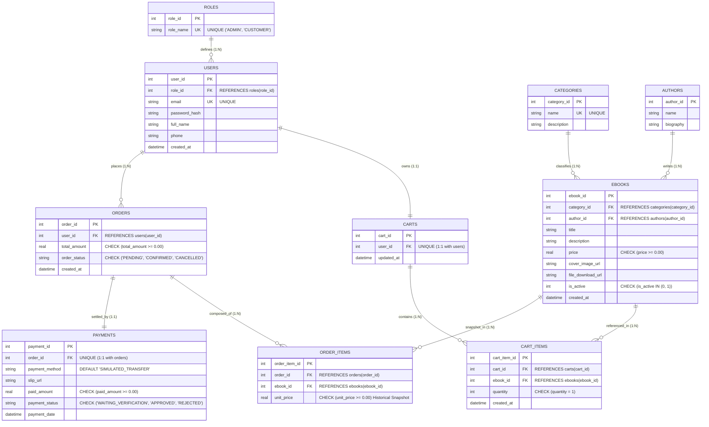

# 01. แผนภาพความสัมพันธ์ฐานข้อมูลเชิงสัมพันธ์ (3NF Relational ER-Diagram)

แผนภาพนี้แสดงโครงสร้างฐานข้อมูลเชิงสัมพันธ์ทั้ง 10 ตาราง ที่ได้รับการปรับปรุงให้อยู่ในรูปแบบ **3NF (Third Normal Form)** พร้อมระบุ Primary Key (`PK`), Foreign Key (`FK`), Data Constraints และ Cardinality ความสัมพันธ์อย่างครบถ้วน

---

## 🗄️ Mermaid ER-Diagram

---

## 🔍 คำอธิบายจุดสำคัญตามหลัก 3NF และความปลอดภัยของข้อมูล

1. **การป้องกันราคาเปลี่ยนย้อนหลัง (`order_items.unit_price`):**
   * แม้ว่าตาราง `ebooks` จะมีฟิลด์ `price` อยู่แล้ว แต่ในตาราง `order_items` จำเป็นต้องเก็บ `unit_price` ณ ขณะสั่งซื้อ เพื่อไม่ให้ยอดสั่งซื้อในอดีตเปลี่ยนแปลงเมื่อผู้ดูแลระบบปรับขึ้น/ลงราคาหนังสือในอนาคต
2. **ความสัมพันธ์ 1:1 ระหว่าง User กับ Cart:**
   * ตาราง `carts` กำหนดคอลัมน์ `user_id` ให้เป็น `UNIQUE` เพื่อรับประกันว่าผู้ใช้ 1 คนจะมีตะกร้าได้เพียง 1 ใบเท่านั้น
3. **ความสัมพันธ์ 1:1 ระหว่าง Order กับ Payment:**
   * ตาราง `payments` กำหนดคอลัมน์ `order_id` ให้เป็น `UNIQUE` เพื่อรับประกันว่า 1 คำสั่งซื้อจะจับคู่กับรายการชำระเงินเพียง 1 รายการ
4. **Data Integrity Constraints:**
   * `price >= 0.00` และ `paid_amount >= 0.00` ป้องกันยอดเงินติดลบ
   * `quantity = 1` ใน `cart_items` เป็นกฎธุรกิจสำหรับสินค้าประเภท E-Book (ไม่มีความจำเป็นต้องซื้อซ้ำหลายก็อปปี้ในออเดอร์เดียวกัน)
