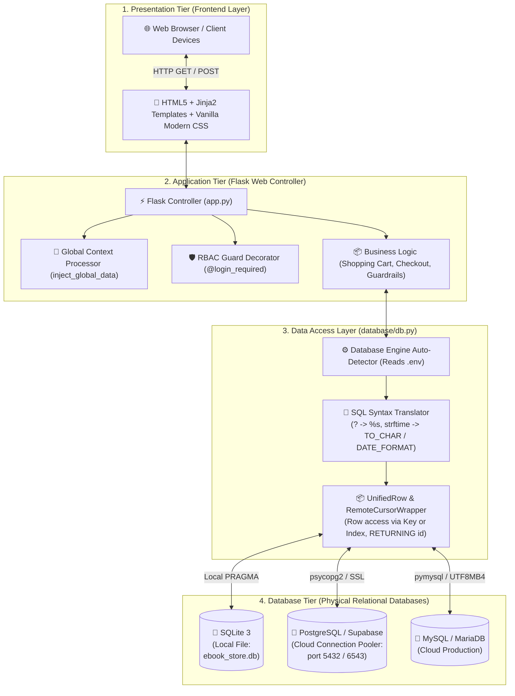

# 02. แผนภาพสถาปัตยกรรมระบบ (System Architecture Diagram)

แผนภาพนี้แสดงสถาปัตยกรรมระบบแบบ **4-Tier Clean Architecture** ที่แยกเลเยอร์การทำงานอย่างเป็นระบบ พร้อมแสดงจุดเด่นของ **Data Access Layer (`database/db.py`)** ที่รองรับ Multi-Engine Database

---

## 🏗️ Mermaid Architecture Diagram

---

## 🔍 คำอธิบายการทำงานในแต่ละเลเยอร์

1. **Presentation Tier:** แสดงผลด้วย HTML5 + Vanilla CSS ที่ออกแบบให้อ่านง่าย รองรับ Responsive และเรนเดอร์ข้อมูลแบบ Dynamic ผ่าน Jinja2 Templates
2. **Application Tier:** ควบคุม Routing และตรรกะทางธุรกิจใน [app.py](file:///c:/Users/titan/OneDrive/เดสก์ท็อป/miniproject-database/app.py) พร้อมทั้งระบบป้องกันความปลอดภัย เช่น แฮชรหัสผ่าน และ Role-Based Access Control
3. **Data Access Layer:** จุดเด่นของสถาปัตยกรรมนี้คือ [database/db.py](file:///c:/Users/titan/OneDrive/เดสก์ท็อป/miniproject-database/database/db.py) ซึ่งทำหน้าที่เป็นตัวกลาง (Adapter) ปรับคำสั่ง SQL ให้เข้ากับไวยากรณ์ของฐานข้อมูลแต่ละตัวโดยอัตโนมัติ ทำให้นักพัฒนาไม่ต้องแก้โค้ดใน [app.py](file:///c:/Users/titan/OneDrive/เดสก์ท็อป/miniproject-database/app.py) เลยเมื่อย้ายฐานข้อมูล
4. **Database Tier:** ฐานข้อมูลเชิงสัมพันธ์ที่เก็บข้อมูลจริง สามารถรันในเครื่องด้วย SQLite หรือเชื่อมต่อไปยัง Cloud อย่าง Supabase (PostgreSQL) ตามที่ตั้งค่าไว้ในไฟล์ [.env](file:///c:/Users/titan/OneDrive/เดสก์ท็อป/miniproject-database/.env)
