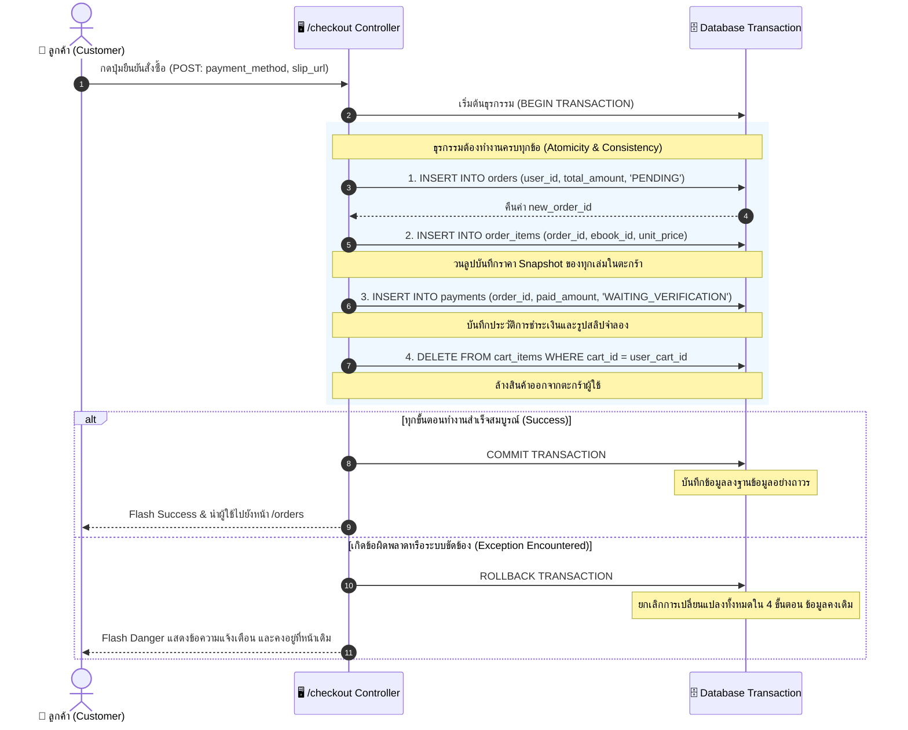

# 03. แผนภาพลำดับการทำงานคำสั่งซื้อ (Checkout & ACID Transaction Sequence)

แผนภาพนี้แสดงขั้นตอนการทำงานของกระบวนการสั่งซื้อสินค้า (Checkout) ผ่านมุมมองของ **Database Transaction (ACID Properties)** ซึ่งรับประกันว่าข้อมูลทั้ง 4 ตารางจะถูกบันทึกสำเร็จพร้อมกันทั้งหมด หากมีขั้นตอนใดเกิดข้อผิดพลาด ระบบจะทำ `ROLLBACK` ทันที

---

## 💳 Mermaid Sequence Diagram

---

## 🔍 คุณสมบัติ ACID ที่เกิดขึ้นในกระบวนการนี้

* **Atomicity (ความเป็นหนึ่งเดียว):** หากเกิดไฟดับ หรือระบบล่มในขณะกำลัง `DELETE FROM cart_items` คำสั่งซื้อจะไม่ค้างอยู่ครึ่งๆ กลางๆ เพราะระบบจะย้อนสถานะกลับทั้งหมดเหมือนไม่เคยทำรายการ
* **Consistency (ความสอดคล้อง):** ข้อมูลทุกแถวที่บันทึกต้องเป็นไปตาม Foreign Key และ Check Constraints เช่น `paid_amount >= 0` และ `order_status IN ('PENDING', 'CONFIRMED', 'CANCELLED')`
* **Isolation (ความโดดเดี่ยว):** ในขณะที่ Transaction กำลังทำงาน ผู้ใช้อื่นจะไม่สามารถเห็นข้อมูลที่ยังบันทึกไม่เสร็จ
* **Durability (ความคงทนถาวร):** เมื่อคำสั่ง `COMMIT` สำเร็จ ข้อมูลคำสั่งซื้อและยอดชำระเงินจะถูกจัดเก็บลงดิสก์อย่างถาวร
