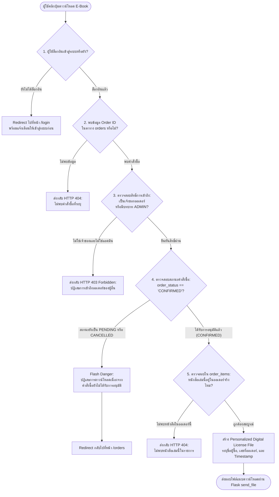

# 04. แผนภาพกระบวนการตรวจสอบสิทธิ์ดาวน์โหลด (Download Guardrail Flowchart)

แผนภาพนี้แสดงขั้นตอนการทำงานของระบบความปลอดภัย **Security Guardrail** ในฟังก์ชัน `download_ebook(order_id, ebook_id)` เพื่อป้องกันไม่ให้ผู้ใช้แอบดาวน์โหลดหนังสือดิจิทัลโดยไม่ได้ชำระเงิน หรือเข้าถึงไฟล์ของผู้อื่น

---

## 🛡️ Mermaid Flowchart

---

## 🔍 จุดเด่นของการออกแบบความปลอดภัย (Security Highlights)

1. **Defense-in-Depth:** มีการตรวจสอบหลายชั้น ไม่เพียงแค่ตรวจสถานะล็อกอิน แต่ตรวจลึกถึงความเป็นเจ้าของ (`user_id`) และสถานะการชำระเงิน (`CONFIRMED`)
2. **Dynamic Generation:** ไม่ได้ใช้ Static File ลิงก์ตรงที่เสี่ยงต่อการถูกแชร์ URL แต่ใช้วิธีการสร้างเนื้อหาไฟล์ดิจิทัลพร้อมตราประทับลิขสิทธิ์ประจำตัวผู้ซื้อ (Licensed To) แบบ Real-time
3. **Protection against Insecure Direct Object References (IDOR):** หากผู้ใช้พยายามเปลี่ยนตัวเลข `order_id` ใน URL ระบบจะดักจับด้วยเงื่อนไขข้อ 3 ทันที
