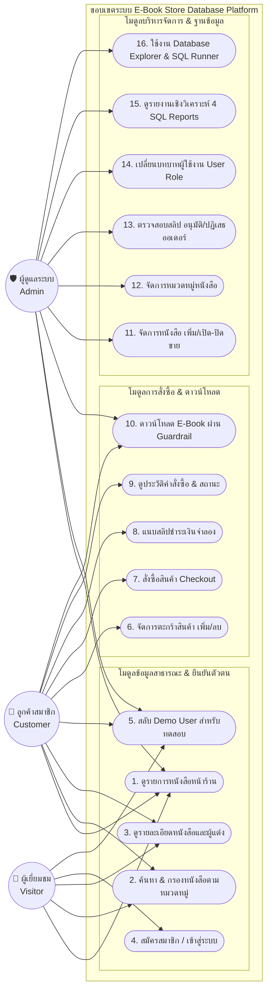

# 05. แผนภาพการใช้งานระบบตามบทบาทผู้ใช้ (Use Case Diagram)

แผนภาพนี้แสดงขอบเขตสิทธิ์และความสามารถในการใช้งานระบบ โดยจำแนกตาม 3 ตัวละครหลัก (Actors): **ผู้เยี่ยมชมทั่วไป (Visitor)**, **ลูกค้าสมาชิก (Customer)**, และ **ผู้ดูแลระบบ (Admin)**

---

## 👥 Mermaid Use Case Diagram

---

## 🔍 สรุปการแบ่งบทบาท (Role Matrix)

| ฟังก์ชันการทำงาน | Visitor (บุคคลทั่วไป) | Customer (ลูกค้า) | Admin (ผู้ดูแลระบบ) |
| :--- | :---: | :---: | :---: |
| ดูแคตตาล็อกหนังสือ / ค้นหา | ✅ | ✅ | ✅ |
| สมัครสมาชิก / ล็อกอิน | ✅ | ✅ | ✅ |
| เพิ่มหนังสือลงตะกร้า / แก้ไขตะกร้า | ❌ | ✅ | ❌ |
| สั่งซื้อ Checkout และแนบสลิป | ❌ | ✅ | ❌ |
| ดาวน์โหลดไฟล์ E-Book ของออเดอร์ตนเอง | ❌ | ✅ | ✅ (ดูตัวอย่างได้) |
| เพิ่มหนังสือใหม่ / ปิดการขาย | ❌ | ❌ | ✅ |
| อนุมัติสลิป / ปรับสถานะคำสั่งซื้อ | ❌ | ❌ | ✅ |
| ดูรายงาน 4 SQL Analytics Dashboard | ❌ | ❌ | ✅ |
| สำรวจ Data Dictionary & รันคำสั่ง SQL สด | ✅ (Read-Only) | ✅ (Read-Only) | ✅ (Read-Only) |
