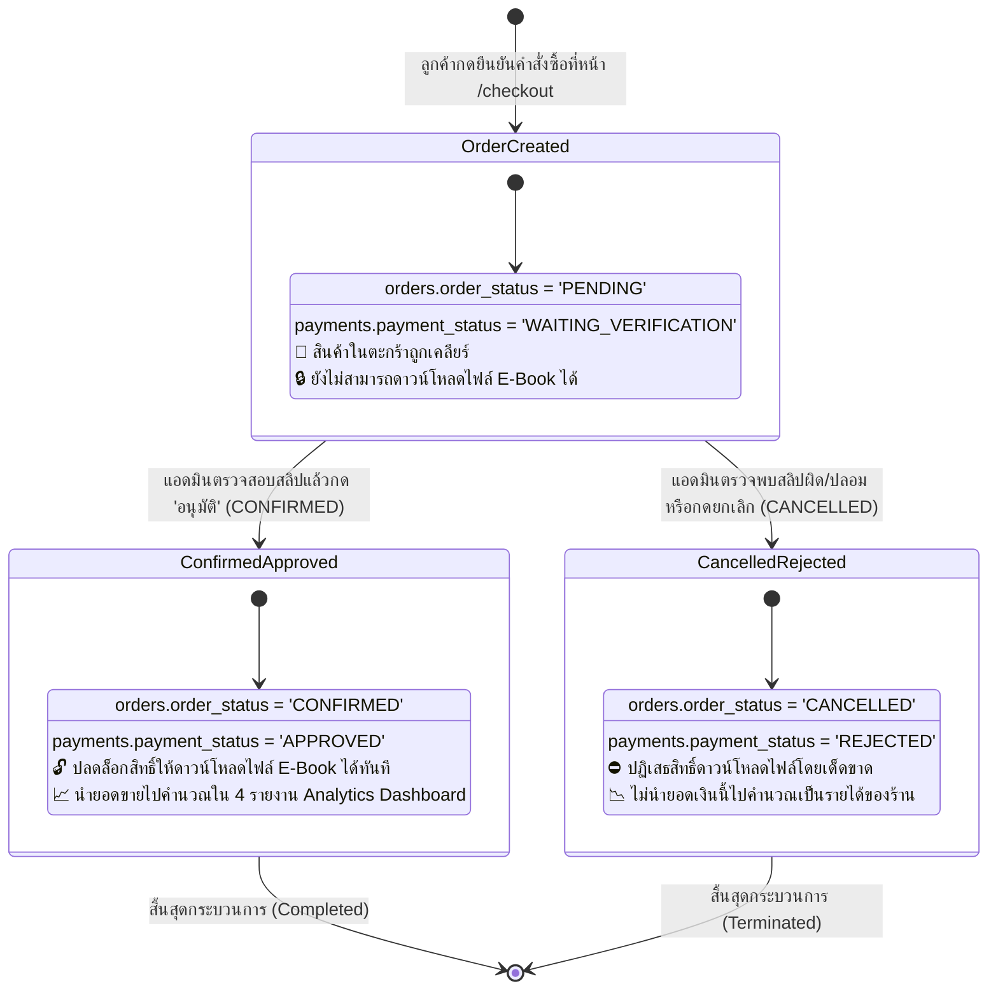

# 06. แผนภาพวงจรสถานะคำสั่งซื้อและการชำระเงิน (Order & Payment State Machine)

แผนภาพนี้แสดงวงจรชีวิต (Lifecycle) และการเปลี่ยนสถานะของคำสั่งซื้อในตาราง `orders` และการชำระเงินในตาราง `payments` ตั้งแต่การสั่งซื้อจนถึงการอนุมัติหรือปฏิเสธ

---

## 🔄 Mermaid State Machine Diagram

---

## 🔍 ตารางเปรียบเทียบผลลัพธ์ของสถานะในระบบ

| สถานะคำสั่งซื้อ (`order_status`) | สถานะการชำระเงิน (`payment_status`) | สิทธิ์การดาวน์โหลดหนังสือ | ผลต่อรายงานยอดขาย (Analytics) |
| :---: | :---: | :---: | :---: |
| **`PENDING`** | `WAITING_VERIFICATION` | ❌ ปฏิเสธ (รอตรวจสอบ) | ไม่ถูกนับเป็นรายได้ (นับเป็น Pending Order) |
| **`CONFIRMED`** | **`APPROVED`** | ✅ **อนุญาตให้ดาวน์โหลดได้** | **ถูกคำนวณเป็นยอดขายจริง (Revenue & Units Sold)** |
| **`CANCELLED`** | `REJECTED` | ❌ ปฏิเสธโดยเด็ดขาด | ไม่ถูกนับเป็นรายได้ (นับเป็น Cancelled Order) |
