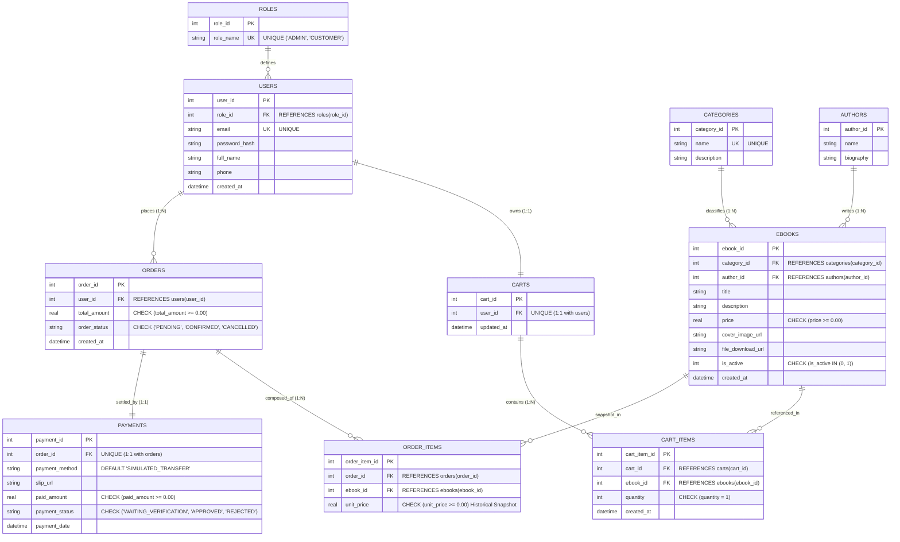
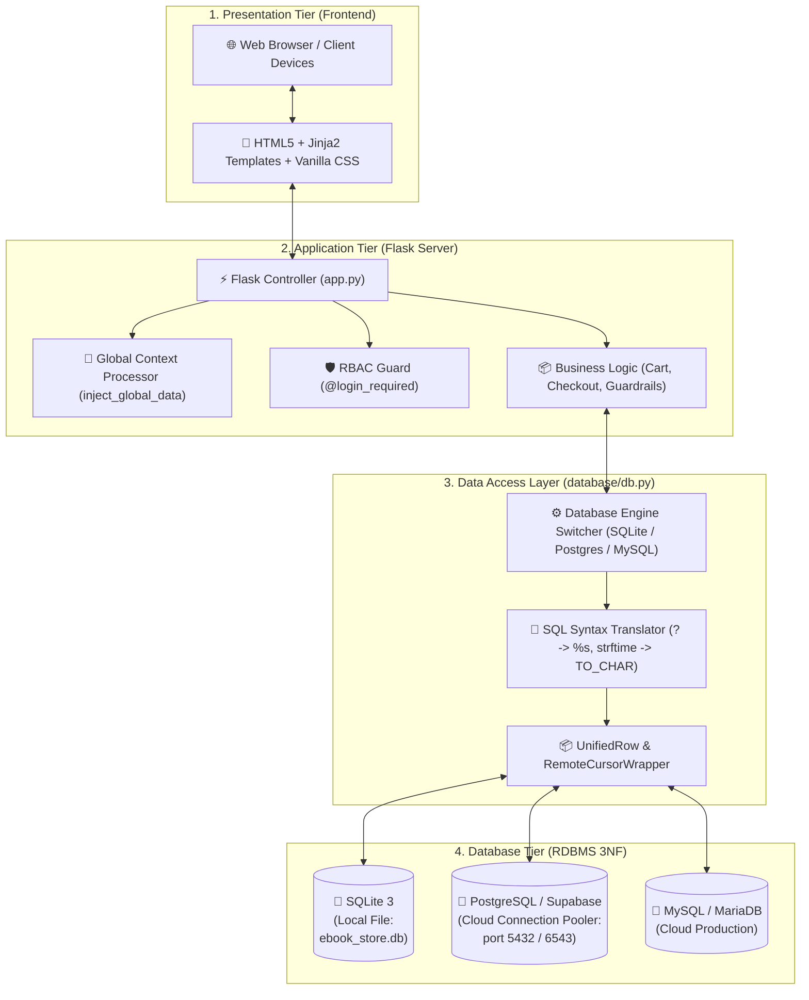
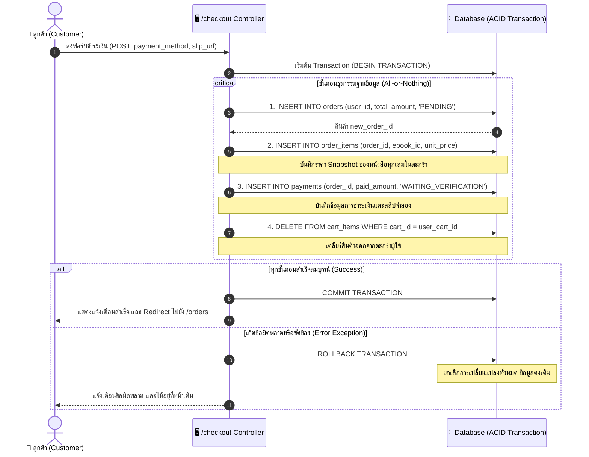
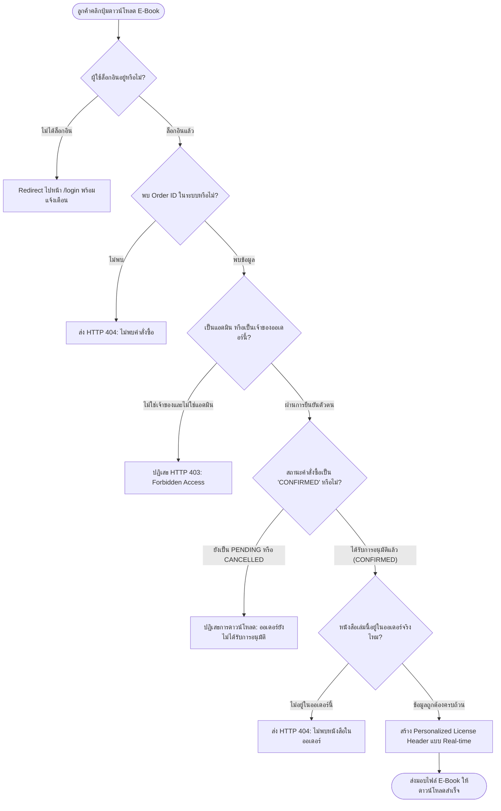
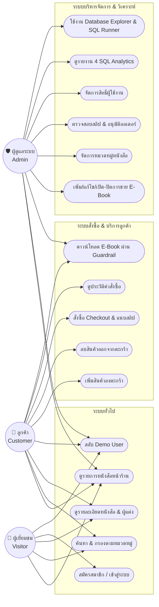
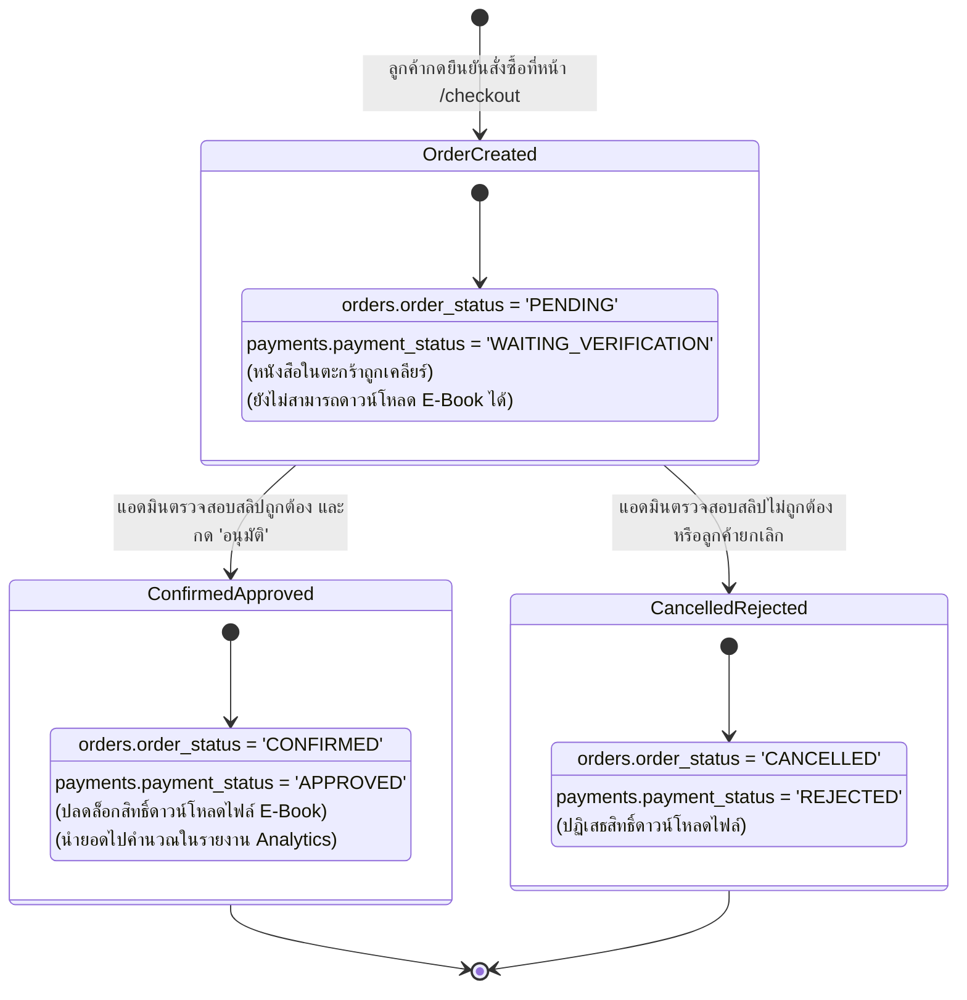

# 07. แผนภาพแสดงการทำงานของระบบ (System Diagrams & Workflows)

เอกสารนี้รวบรวม **Diagram สำคัญทั้ง 6 รูปแบบ** ที่จำเป็นต่อการอธิบายและนำเสนอโครงงานวิชาฐานข้อมูล (Database Mini Project) โดยใช้สัญลักษณ์มาตรฐานและรูปแบบ **Mermaid Diagram** ที่สามารถแสดงผลบน GitHub, IDE หรือนำไปแปลงเป็นรูปภาพใส่ในเล่มรายงานและสไลด์ได้ทันที

---

## 1. 🗄️ แผนภาพความสัมพันธ์ฐานข้อมูลเชิงสัมพันธ์ (3NF ER-Diagram)
* **จุดประสงค์:** แสดงโครงสร้างฐานข้อมูลทั้ง 10 ตาราง ความสัมพันธ์ (Cardinality), Primary Key (`PK`), Foreign Key (`FK`) และ Constraints ที่เป็นไปตามรูปแบบ **3NF (Third Normal Form)**

---

## 2. 🏗️ แผนภาพสถาปัตยกรรมระบบ (System Architecture Diagram)
* **จุดประสงค์:** แสดงการแยก Layer การทำงาน และความสามารถของ Data Access Layer ที่รองรับทั้ง **SQLite (Local)**, **Supabase PostgreSQL (Cloud)**, และ **Cloud MySQL**

---

## 3. 💳 แผนภาพลำดับการทำงานคำสั่งซื้อ (Checkout & ACID Transaction Sequence)
* **จุดประสงค์:** อธิบายการทำงานของฟังก์ชัน `checkout()` ภายใต้ Database Transaction หากขั้นตอนใดล้มเหลว จะถูก `ROLLBACK` ทั้งหมด

---

## 4. 🛡️ แผนภาพกระบวนการตรวจสอบสิทธิ์ดาวน์โหลด (Download Guardrail Flowchart)
* **จุดประสงค์:** แสดงขั้นตอนการตรวจสอบสิทธิ์ 4 ด่านของฟังก์ชัน `download_ebook()` เพื่อรักษาความปลอดภัยของไฟล์ E-Book

---

## 5. 👥 แผนภาพการใช้งานระบบตามบทบาท (Use Case Diagram)
* **จุดประสงค์:** แสดงขอบเขตการทำงานของแต่ละ Actor ภายในระบบ

---

## 6. 🔄 แผนภาพวงจรสถานะคำสั่งซื้อและการชำระเงิน (Order & Payment State Machine)
* **จุดประสงค์:** แสดงการเปลี่ยนแปลงสถานะของ `orders.order_status` และ `payments.payment_status`

